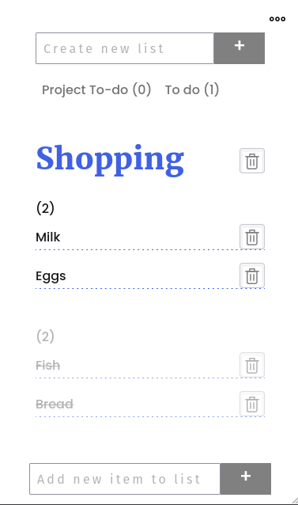

# Simple application to make lists (To-do, shopping...
Made with vanilla JavaScript. Used webpack to bundle everything (modules, styles) into one html file.
[Check it live](https://codevivi.github.io/my-lists/)
<br>

## Functionality
* Create and delete lists
* Add, remove, toggle complete items.
* Saves lists to Your browsers localStorage.
* Possibility to save lists to file (json format) and import from file.
## To use it offline:
download ***index.html from dist*** folder and open in browser.

## If downloaded all repository: 
make sure you have node installed with npm, go into directory and run:
```bash
npm install
npm run build
```
It will create dist folder with index.html and js.map (for debugging).
<br>
***Open index.html(in dist folder) in browser***. 
### To use on mobile (offline)
Download index.html and open with Chrome browser or create shortcut with ShortcutMaker (android)


